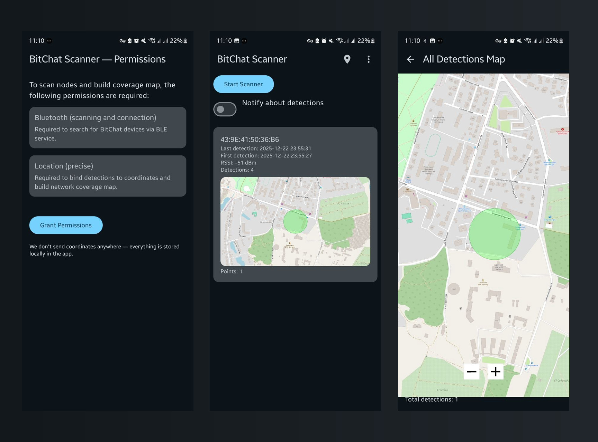

# BitChat Scanner

BitChat Scanner is an Android 8.0+ app for detecting nearby BitChat devices over BLE, storing detections locally, and visualizing signal coverage on a map. It uses an active scan callback while the Activity is visible and Android's system-managed filtered delivery when a started session continues while the app is hidden.



## What the app does

- Scans for nearby BitChat devices over Bluetooth Low Energy.
- Starts and stops scanning explicitly from the main screen.
- Uses an active callback while the Activity is visible; on Android 8.0+ a hidden started session uses a filtered `PendingIntent` delivered to a non-exported receiver.
- Stores detection history locally on the device.
- Shows per-device cards with first seen, last seen, RSSI, and detection count.
- Draws approximate coverage circles on a map based on recorded coordinates and signal strength.
- Opens a full-screen map with all saved detections.
- Can optionally notify about detections; an opt-in notification shows the matching device name or address and RSSI, subject to the Android 13+ notification permission and a cooldown.

## Privacy and data handling

- Detection history is stored in the app-local database; the app does not sync or upload records to an app backend, and app backup is disabled for this data.
- This public repository does not require Firebase or other private service configuration to build.
- Map views download tiles for the displayed area through osmdroid / OpenStreetMap; those tile requests go to the configured map-tile provider. Detection records are not uploaded to an app backend.
- The app does not use a foreground service or background location permission. Hidden scan delivery is system-managed and best-effort.

## Required permissions

- On Android 12+ (API 31+), `BLUETOOTH_SCAN` and `BLUETOOTH_CONNECT` are the core BLE discovery permissions.
- On Android 8.0–11 (API 26–30), `ACCESS_COARSE_LOCATION` and `ACCESS_FINE_LOCATION` are required for BLE scan results.
- On Android 12+, location is optional for scanning. Grant `ACCESS_FINE_LOCATION` (requested together with coarse location for the precise grant) to attach coordinates to visible active-callback detections; hidden detections never receive fresh coordinates.
- `POST_NOTIFICATIONS` is optional for detection notifications; Android 13+ requires its runtime grant before notifications can be shown.

## Tech stack

- Kotlin
- Jetpack Compose
- Lifecycle-aware callback scanning plus system-managed filtered `PendingIntent` delivery (no foreground service or background location)
- osmdroid for map rendering

## Scanning lifecycle

- Tap **Start Scanner** while the main Activity is visible to begin a scan session.
- While the Activity is visible, results arrive through the active BLE scan callback.
- On Android 8.0+ (API 26+), a started session switches to a system-managed filtered `PendingIntent` scan when the app is hidden. The scan `PendingIntent` uses `FLAG_MUTABLE | FLAG_UPDATE_CURRENT` because the Bluetooth framework adds result extras; its explicit package/component and non-exported receiver constrain delivery to this app.
- Hidden delivery is best-effort and may be throttled, delayed, batched, or stopped by the system; it is not continuous background monitoring. The app does not claim guaranteed background detection.
- Some vendor BLE stacks reject the zero-length service-data presence filter. The fallback keeps service-UUID and solicitation filters, so service-data-only BitChat advertisements may be missed while hidden even though the visible callback matcher accepts them.
- Background detections do not collect a fresh coordinate. They remain in local history without map coordinates; visible callback detections may include the current best-effort coordinate when precise location is granted.
- Tap **Stop Scanner** to end both active-callback and hidden delivery registration. There is no foreground service and no `ACCESS_BACKGROUND_LOCATION` permission.
- Detection history and device summaries are persisted locally, so stopping a session does not delete previously recorded data.

## Building locally

```bash
./gradlew assembleDebug
```

`assembleDebug` produces an installable APK signed with the Android debug key. It is for development and QA only; it is not the release signing identity and cannot be used for production updates. A local `./gradlew assembleRelease` without the CI signing environment produces `app-release-unsigned.apk`; do not distribute or present that file as a release build.

Notes:

- The public repo intentionally excludes local/private files such as `.idea/`, `local.properties`, `app/google-services.json`, and release signing keystores.
- If you want to experiment with your own private services locally, keep those files only on your machine and do not commit them.
- Release signing is configured through environment variables in CI, not through committed files.

## CI artifacts and GitHub releases

Android CI runs on pull requests, pushes to `main`, and manual CI dispatches. The run summary's **Artifacts** section contains only the explicitly packaged files below; artifact retention is separate from GitHub Release retention.

| Audience / trigger | Artifact name | Retention | What to use it for |
| --- | --- | --- | --- |
| Developer / pull request | `bitchat-scanner-debug-pr<PR_NUMBER>-<SHORT_SHA>` | 7 days | Install the debug-signed APK for a smoke test; development only. |
| QA / push to `main` | `bitchat-scanner-debug-main-<SHORT_SHA>` | 30 days | Test the latest green `main` build; development only. |
| Test reports / any CI run | `bitchat-scanner-junit-<RUN_ID>` and `bitchat-scanner-lint-<RUN_ID>` | PR: 7 days; otherwise: 30 days | Inspect JUnit XML and lint output. |
| Release manager / version tag | `bitchat-scanner-vX.Y.Z-release-signed` | 90 days as an Actions artifact | Signed APK for device installation, signed AAB for Google Play, and owned-name checksum/build-info/manifest-audit/signer-metadata files. |
| Crash analysis / repository Actions users | `bitchat-scanner-vX.Y.Z-r8-mapping` | 90 days | Actions-only R8 obfuscation mapping; repository visibility follows GitHub Actions artifact permissions, and it is not a GitHub Release asset. |

Manual **Android CI** dispatches use the selected ref (sanitized for the artifact name) instead of the `pr<PR_NUMBER>` or `main` channel, and retain the debug artifact and reports for 30 days.

For a PR or `main` build, open **Actions**, select **Android CI**, open the green run, choose **Artifacts**, and download the matching ZIP. Extract it and install the APK, for example:

```bash
adb install -r bitchat-scanner-debug-pr42-a1b2c3d.apk
```

The debug APK is debug-key signed and must not be used for production distribution or update testing. Its `build-info.json` records `signed: false` to distinguish it from a release-signed artifact. The packaged `checksums.txt` can be checked with `sha256sum -c checksums.txt` from the extracted directory.

### Publishing a signed release

Release publishing is tag-only. Update `versionName` and `versionCode` in `app/build.gradle`, merge the commit into `main`, then push an exact `vX.Y.Z` tag:


```bash
git tag v1.0.3
git push origin v1.0.3
```

The **Android Release** workflow validates the `vX.Y.Z` format, requires the tagged commit to be an ancestor of `origin/main`, and requires the tag to match `versionName` exactly. To rerun an existing tag manually, choose **Actions → Android Release → Run workflow** and enter that existing tag in the required `tag` input (for example, `v1.0.3`); the workflow still validates the tag before accessing signing secrets.

The canonical release page contains `bitchat-scanner-vX.Y.Z-release-signed.apk`, `bitchat-scanner-vX.Y.Z-release-signed.aab`, `bitchat-scanner-vX.Y.Z-release-signed.sha256`, `bitchat-scanner-vX.Y.Z-release-signed.build-info.json`, and `bitchat-scanner-vX.Y.Z-release-signed.signer-metadata.txt`. The APK is the installable/sideloadable artifact. The AAB is for Google Play upload and cannot be installed directly with `adb`. The same package is retained as an Actions artifact for 90 days; that artifact additionally contains `bitchat-scanner-vX.Y.Z-release-signed.manifest-audit.txt`.

To download the release package from Actions, open **Actions → Android Release**, select the completed tag run, choose **Artifacts**, and download `bitchat-scanner-v1.0.3-release-signed` (substitute the actual tag). From the extracted directory, verify `sha256sum -c bitchat-scanner-v1.0.3-release-signed.sha256`. For long-lived distribution, use the matching GitHub Release assets instead; use the R8 mapping artifact for crash analysis only.

For example, tag `v1.0.3` must match:

```groovy
versionName "1.0.3"
```

If the tag and app version do not match, or the commit is not on `main`, the `validate` job fails instead of allowing a mismatched build to reach `publish`. Release assets remain on the GitHub Release until that release is removed; this is independent of the 90-day Actions artifact retention.

The `build` job uses the protected GitHub Actions `release` environment. Configure required reviewers/protection rules there and store these as environment secrets, never in PR or `main` jobs:

- `ANDROID_KEYSTORE_BASE64`
- `ANDROID_KEYSTORE_PASSWORD`
- `ANDROID_KEY_ALIAS`
- `ANDROID_KEY_PASSWORD`

The `validate` job and the signing `build` job use read-only repository permissions and `persist-credentials: false`; the signing `build` job is the only job that receives the `release` environment secrets. It verifies APK and AAB signatures and uploads the exact signed artifact. A separate `publish` job has `contents: write`, receives no signing secrets, downloads that exact artifact, and uploads only the allowlisted APK/AAB and prefixed metadata files to the GitHub Release. Missing signing secrets fail the build; no unsigned tag artifact is published. Do not upload `app/build/**` wholesale: it can contain large R8 outputs, reports, generated metadata, or runner paths. CI artifacts contain build products only; the app's local SQLite detection history, map cache, and location records are not part of an APK/AAB build.

## Project notes

- Architecture overview: [ARCHITECTURE.md](ARCHITECTURE.md)
